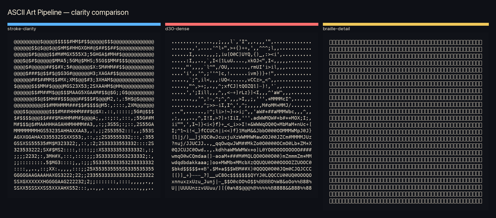
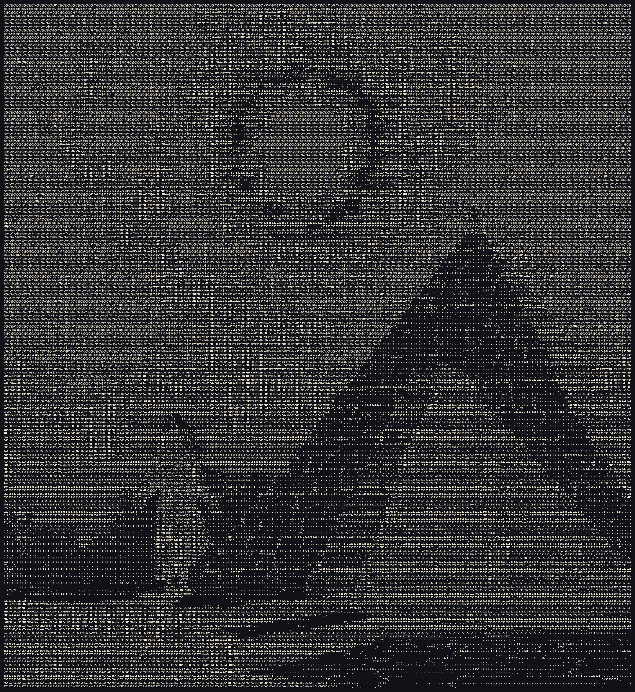

# ASCII Art Pipeline

A high-fidelity ASCII rendering foundation for still images, video, and Herm-style animated eikons. Built on `ascii-image-converter` with rigorous quality gates, integer-resolution scaling, and preset pipelines.

## Features

- **Four curated presets**: `stroke-clarity` (high-contrast direct), `d30-dense` (block-mode dense), `braille-detail` (4× effective resolution), `eikon-motion` (video pipeline)
- **Integer scaling**: `--scale N` (1–16) multiplies the base 48×24 grid; intermediate grids scale automatically
- **Quality diagnostics**: unique glyphs, fill/heavy/light ratios, automatic verdict (high-contrast / low-contrast-garble-risk / braille-dominant)
- **Preview rendering**: side-by-side PNGs for visual QA
- **Still-image and video eikon workflows**
- **No chafa dependency** for still images; standalone `ascii-image-converter` only

## Installation & setup

Requires Python 3.11+ and the `ascii-image-converter` binary.

```bash
# Install ascii-image-converter (if not already)
go install github.com/TheZoraiz/ascii-image-converter@latest

# Ensure binary is on PATH
export PATH=$PATH:~/go/bin
```

Clone this repository and run commands via `python3 -m ascii_pipeline.cli`.

## Quick start

Render a still image at default Herm avatar size (48×24):

```bash
ascii-pipeline render-image --input photo.jpg --preset stroke-clarity --out out.txt
```

Add `--preview-out` to get a side-by-side PNG:

```bash
ascii-pipeline render-image --input photo.jpg --preset stroke-clarity --out out.txt --preview-out preview.png
```

## Canonical presets

| Preset | Charset | Target | Intermediate? | Best for |
|--------|---------|--------|---------------|----------|
| `stroke-clarity` | `DENSE_REF_CHARSET` (12 glyphs `@$#MHAGXS532;:,. `) | 48×24 | None | High-contrast silhouettes; safe default |
| `d30-dense` | `D30_CHARSET` (68 glyphs, extended D30 palette) | 48×24 | 384×192 → block collapse | Dense texture, D30 HUD aesthetic |
| `braille-detail` | Unicode Braille (U+2800–U+28FF) | 48×24 | None (Floyd–Steinberg dither) | Maximum detail, halftone style |
| `eikon-motion` | D30 charset | 48×24 | 384×192 block collapse | Video → animated eikon (via `build-eikon`) |

**Preset selection guide:**
- Use **stroke-clarity** for crisp, instantly legible ASCII; it works universally and scales to very high resolutions (up to 768×384).
- Use **d30-dense** when you want the dense cyber-noir look with varied stroke weight; expect lower contrast on high-contrast geometric scenes (portrait heuristics may flag "garble-risk" even though the result can be visually strong).
- Use **braille-detail** when you need more detail than 48×24 cells can hold and your terminal supports Braille rendering.
- Use **eikon-motion** for generating animated eikons from video frames; this preset is used by `build-eikon`, not `render-image`.

## Command reference

### ascii-pipeline presets
List available preset names.  
`--verbose` — show full preset contract (backend, target, source_scale, preprocess steps, charset, intermediate_grid).

### ascii-pipeline diagnose
Analyze a `.txt` or `.eikon` file and print diagnostics JSON.

| Flag | Description |
|------|-------------|
| `--input <path>` | File to analyze (required) |
| `--expected-width <int>` | Expected grid width; default 48 |
| `--expected-height <int>` | Expected grid height; default 24 |
| `--pretty` | Indent JSON output |

Output includes dimensions consistency, per-frame aggregate metrics, and a `verdict` string.

### ascii-pipeline render-preview
Render a single text frame or eikon frame to a PNG image.

| Flag | Description |
|------|-------------|
| `--input <path>` | Source .txt or .eikon file (required) |
| `--out <path>` | Output PNG path (required) |
| `--frame <int>` | For .eikon: which frame to render; default 0 |
| `--font-size <int>` | Font size for rendering; default 18 |

### ascii-pipeline render-image
Render a still image to ASCII text using a named preset. Primary still-image command.

| Flag | Description |
|------|-------------|
| `--input <path>` | Source image (required) |
| `--out <path>` | Output .txt file (required) |
| `--preset <name>` | Preset name; default `stroke-clarity` |
| `--preview-out <path>` | Optional side-by-side PNG (original vs ASCII) |
| `--diagnostics-out <path>` | Optional JSON metrics report |
| `--fullsize` | Alias for `--scale 4`; 192×96 showcase tier |
| `--scale N` | Integer multiplier of base 48×24 grid. Range 1–16. Default 1. |
| `--pretty` | Indent JSON output |

**Scaling behavior:**
- Scales final grid, any `intermediate_grid`, and the source-image `source_scale` by factor N.
- `--fullsize` ≡ `--scale 4`.
- Direct-path presets (`stroke-clarity`, `braille-detail`) are fast at all scales.
- Block-mode presets (`d30-dense`) become memory-intensive at high N due to intermediate grid explosion. Recommended **N ≤ 8** for block-mode.
- Verified on 800×800 test image: stroke-clarity ~0.3s at N=16; d30-dense ~27s at N=16.

### ascii-pipeline build-eikon
Assemble an animated eikon from a directory of PNG frames.

| Flag | Description |
|------|-------------|
| `--frames-dir <path>` | Directory containing PNG frames (required) |
| `--out <path>` | Output .eikon file (required) |
| `--grid <WxH>` | Character grid, e.g. `192x96` or `48x24` |
| `--charset <name>` | `dense-ref` (12 glyphs) or `d30` (68 glyphs) |
| `--collapse-to <WxH>` | Optional secondary collapse grid |
| `--id <string>` | Eikon ID; defaults to output filename stem |
| `--pretty` | Indent JSON header output |

**Policy:** Build full-size master first (192×96 or larger), then collapse to 48×24 only if required for Herm deployment.

## Resolution scaling & performance

Base grid: **48×24** (Herm avatar dimensions). `--scale N` multiplies:

| N | Grid (W×H) | Name |
|---|------------|------|
| 1 | 48×24 | avatar (default) |
| 4 | 192×96 | fullsize / showcase |
| 8 | 384×192 | large |
| 16 | 768×384 | max practical (terminal legibility limit) |

**Intermediate-grid scaling:** Block-mode presets define an intermediate grid that itself scales by N. For `d30-dense` (intermediate 384×192):
- N=8 → intermediate 3072×1536 (heavy but functional)
- N=16 → intermediate 6144×3072 (likely exceeds practical limits)

**Rule:** Prefer `stroke-clarity` for very high resolutions; cap block-mode at **N ≤ 8**.

Tool ceiling: empirically confirmed up to 768×384; higher probably works but untested.

## Quality diagnostics

Diagnostics analyze the final ASCII grid and produce:

| Metric | Meaning | Good range (portrait) |
|--------|---------|-----------------------|
| `unique_glyphs_mean` | Distinct character count | 60–75 (D30 ASCII), 90–100 (Braille) |
| `fill_ratio_mean` | Fraction of non-blank cells | ≈1.0 (dense fills normal) |
| `heavy_ratio_mean` | Portion of heavy-weight chars (`@ # $ % & _ ~`) | >0.30 |
| `light_ratio_mean` | Portion of low-noise chars (`I l i ; : , . ' \``) | <0.20 |
| `braille_ratio_mean` | Fraction of Braille patterns (Braille preset) | >0.80 |
| `motion_char_diff_mean` | Frame-to-frame character difference (video) | >0.05 for visible motion |
| `verdict` | Summarized tag | `high-contrast`, `low-contrast-garble-risk`, `braille-dominant`, … |

**Important:** Metrics are guidance, not absolute. Always visually verify with `--preview-out`. Some scene-class images (architecture, cosmic) may score low on portrait heuristics yet remain visually effective.

## Examples

### Cosmic pyramid — full-size scene example

`examples/scene-cosmic-pyramid/` provides a complete worked example with a square high-contrast illustration, demonstrating all three presets across multiple scales, animated eikon generation, and diagnostics.

#### Preset comparison board (48×24)



#### High-resolution stroke-clarity variants

| 384×192 (scale 8) | 768×384 (scale 16) |
|-------------------|--------------------|
|  |  |

Full documentation and D30-dense variants: [examples/scene-cosmic-pyramid/README.md](examples/scene-cosmic-pyramid/README.md)

### Gallery

Explore more outputs and motion studies in the local HTML gallery:

[gallery/index.html](gallery/index.html)

## Current status

This repository is production-ready:

- Canonical preset contract with backends and charsets
- Diagnostics engine for text and `.eikon` files
- High-resolution PNG preview generation
- Full-size eikon build pipeline (with optional 48×24 collapse)
- Flagship still-image scene example (cosmic pyramid)
- Animated scene eikon with 52 frames
- Local HTML gallery with side-by-side comparisons
- Focused test suite (10 tests, all passing)
- Dual-track publication: standalone CLI package + Hermes skill

See `docs/canonical-foundation.md` for frozen baseline decisions.

## Publication rule

The `render-image` command uses only `ascii-image-converter`; **no `chafa` dependency**. Historical chafa comparisons remain in the gallery for diagnostic reference but are not the canonical path.

## Planned next

- `ascii-pipeline build-eikon --preset eikon-motion --input source.mp4 --out out.eikon` (video-first wrapper)
- Multi-stage intermediate grid definitions to enable block-mode at extreme scales

## License

MIT
